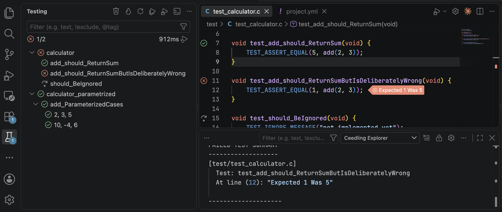
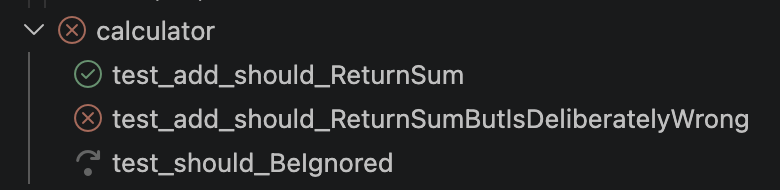
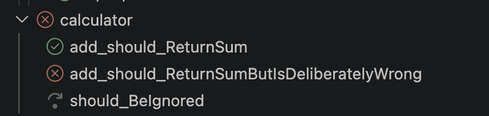
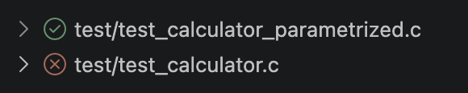
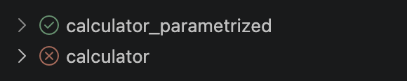
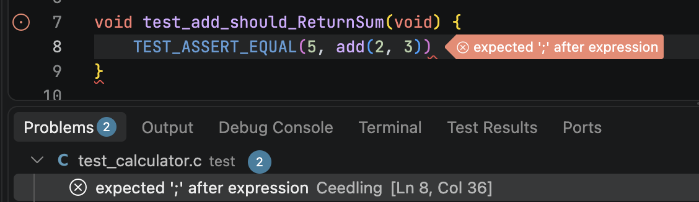

# 🌱 Ceedling Visual Studio Code Extension

[Ceedling] is a handy-dandy build system for C projects. This Visual Studio Code [extension][marketplace] runs your Ceedling test suite using VS Code’s built-in _Testing_ view.



[Ceedling]: https://github.com/ThrowTheSwitch/Ceedling
[marketplace]: https://marketplace.visualstudio.com/items?itemName=throw-the-switch.vscode-ceedling

## Supporting this work

Ceedling and its complementary [ThrowTheSwitch] pieces and parts are and always will be freely available and open source.

💼 **_[Ceedling Suite][ceedling-suite]_** is a growing collection of paid products and services built around Ceedling to help you do even more.
**_[Ceedling Assist][ceedling-assist]_** for support contracts and training is now available.

🙏🏻 **[Please consider supporting Ceedling and this extension as a Github Sponsor][tts-sponsor]**

[ThrowTheSwitch]: https://github.com/ThrowTheSwitch
[ceedling-suite]: https://www.thingamabyte.com/ceedling
[ceedling-assist]: https://www.thingamabyte.com/ceedlingassist
[tts-sponsor]: https://github.com/sponsors/ThrowTheSwitch

# Features

* Displays all detected tests and suites with their state in VS Code’s built-in Test Explorer (the Testing view).
* Adds gutter run/debug icons and CodeLens-style affordances to your test files, generated automatically from each test’s location.
* Shows a failed test’s message and failing line directly in the Test Explorer and the editor.
* Runs a single test function in isolation, without running the rest of its file.
* Can be configured to report compiler and linker problems inline in the editor and in the Problems panel.

# Requirements

## VS Code

Requires VS Code 1.71.0 or later.

## Ceedling

Requires Ceedling 1.0.0 or later. Ceedling 1.0.0 and 1.1.0 are both supported.

_[Ceedling documentation](https://throwtheswitch.github.io/Ceedling/latest/)_

## Parameterized Unity test cases

Parametrized tests using Unity’s `TEST_CASE()` / `TEST_RANGE()` require `:unity` ↳ `:use_param_tests:` ⇒ `true` in your project configuration.

Ceedling 1.0.0 also requires test-file preprocessing disabled (`:project` ↳ `:use_test_preprocessor` ⇒ `:none` (default) or `:mocks`). Ceedling 1.0.0 cannot preserve these macros through preprocessing, but Ceedling 1.1.0 supports parametrized tests with or without preprocessing.

# Getting started

* Install the extension and restart VS Code.
* Open the workspace or folder containing your Ceedling project.
* Configure your Ceedling project configuration filepath in VS Code’s settings if required [see below](#options).
* Configure the shell path where Ceedling is installed in VS Code’s settings if required (Windows) [see below](#options).
* [Enable and configure][cppunit-plugin] the `report_tests_log_factory` Ceedling plugin with the `cppunit` option in your Ceedling project configuration. This generates an XML test report on which this extension depends.
* Open the Testing view.
* Run your tests using the run/debug icons in VS Code’s _Testing_ view or in your test file’s gutter.

[cppunit-plugin]: https://github.com/ThrowTheSwitch/Ceedling/blob/master/plugins/report_tests_log_factory/README.md

# Running and debugging tests

Run and debug tests from the Testing view, or from the gutter next to a test in the editor.


The Testing view’s toolbar also has Clean and Clobber buttons. They run `ceedling clean` and `ceedling clobber` against the current project.

# Configuration

## Options

This table of options should be read as `ceedlingExplorer.<property>`.

| `ceedlingExplorer` Property | Description |
|---|---|
| `.projects` | An array of objects with the path to the Ceedling project (or yml-file) to use (relative to the workspace folder). See below for its `path`, `debugLaunchConfig`, and `name` properties. |
| `.shellPath` | The path to the shell where Ceedling is installed. By default (or if this option is set to `null`), it uses the OS default shell. |
| `.prettyTestLabel` | Shortens the test label in the _Testing_ explorer by dropping its leading prefix (e.g. inactive `test_BlinkTaskShouldToggleLed` vs. active `BlinkTaskShouldToggleLed`).<br><br>Inactive:<br><br><br> Active:<br>|
| `.prettyTestFileLabel` | Shortens the test file label in the _Testing_ explorer by dropping its path, leading prefix, and file type (e.g. inactive `test/LEDs/test_BlinkTask.c` vs. active `BlinkTask`).<br><br>Inactive:<br><br><br> Active:<br> |
| `.testCommandArgs` | The command line arguments used to run Ceedling tests. The first argument has to literally contain the `${TEST_ID}` tag. The value `["test:${TEST_ID}"]` is used by default. For example, the arguments `"test:${TEST_ID}", "gcov:${TEST_ID}", "utils:gcov"` can be used to run tests and generate a gcov report. |
| `.problemMatching` | Configuration of compiler/linker problem matching. See the [Problem matching](#problem%20matching) section for details. |
| `.testCaseMacroAliases` | An array of aliases for Unity’s parameterized test `TEST_CASE` macro. By default it is `["TEST_CASE"]`. |
| `.testRangeMacroAliases` | An array of aliases for Unity’s parameterized test `TEST_RANGE` macro. By default it is `["TEST_RANGE"]`. |
| `.ansiEscapeSequencesRemoved` | Whether ANSI escape sequences are removed from Ceedling `$stdout` and `$stderr`. By default it is `true`. |

### `ceedlingExplorer.projects` properties

- `path`: can point either to a directory containing a "project.yml" file or directly to another .yml file (with the respective project.yml in the same directory). This path should be relative to the workspace root directory.
- `debugLaunchConfig`: must be the *name* property of the launch config (launch.json) that is used for this project. The `${command:ceedlingExplorer.debugTestExecutable}` must still be used.
- `name` (optional): used as the name for the folder containing the tests in the test explorer.

## Problem matching

Problem matching is the mechanism that scans Ceedling output text for known error/warning/info strings and reports these inline in the editor and in the Problems panel. It mimics VS Code’s _Tasks_ `problemMatchers` mechanism.



### Problem matching configuration options

| Property | Description |
|---|---|
| `mode` | Mode of problem matching: either "disabled", a preset (e.g. "gcc"), or custom "patterns" from the patterns array. Default is "disabled". |
| `patterns` | Array of custom pattern objects used for problem matching. If mode is set to "patterns", Ceedling output is scanned line by line using each pattern provided in this array. Default is an empty array. |

Example configuration which is sufficient in most cases:
```json
"ceedlingExplorer.problemMatching": {
	"mode": "gcc"
}
```

### Problem matching pattern options

| Property | Description |
|---|---|
| `scanStdout` | Scan stdout output for problems. Default is false. |
| `scanStderr` | Scan stderr output for problems. Default is true. |
| `severity` | Severity of messages found by this pattern. Correct values are "error", "warning" and "info". Default is "info". |
| `filePrefix` | Used to determine the file’s absolute path if the file location is relative. ${projectPath} is replaced with the project path. An empty string means the file location in the message is absolute. Default is an empty string. |
| `regexp` | The regular expression used to find an error, warning, or info in the output line. ECMAScript (JavaScript) flavor. Tip: you may find [regex101](https://regex101.com/) useful while experimenting with patterns. This property is required. |
| `message` | Index of the problem’s message in the regular expression. This property is required. |
| `file` | Index of the problem’s filename in the regular expression. This property is required. |
| `line` | Index of the problem’s (first) line in the regular expression. Not used if null or not defined. |
| `lastLine` | Index of the problem’s last line in the regular expression. Not used if null or not defined. |
| `column` | Index of the problem’s (first) column in the regular expression. Not used if null or not defined. |
| `lastColumn` | Index of the problem’s last column in the regular expression. Not used if null or not defined. |

Example pattern object (GCC compiler warnings):
```json
{
    "severity": "warning",
    "filePrefix": "${projectPath}",
    "regexp": "^(.*):(\\d+):(\\d+):\\s+warning:\\s+(.*)$",
    "message": 4,
    "file": 1,
    "line": 2,
    "column": 3
}
```

# Commands

The following commands are available in VS Code’s command palette. Use the ID to add them to your keyboard shortcuts. Both also appear as toolbar buttons in the Testing view. Running, debugging, and reloading tests are done from VS Code’s built-in Testing view (or its toolbar/gutter icons) rather than extension-specific commands.

| ID | Command |
|---|---|
| `ceedlingExplorer.clean` | Run `ceedling clean` |
| `ceedlingExplorer.clobber` | Run `ceedling clobber` |

# Debugging

To set up debugging, create a Debug Configuration in `launch.json` and reference its *name* as the `debugLaunchConfig` property of the corresponding entry in `ceedlingExplorer.projects` (see [Options](#options)). If `ceedlingExplorer.projects` isn’t configured at all, the extension falls back to a single default project expecting a launch configuration literally named `ceedling`.

Migrating from the original _Ceedling Test Explorer_ extension? Its flat `ceedlingExplorer.debugConfiguration` string setting no longer exists. Use `ceedlingExplorer.projects[].debugLaunchConfig` instead, as above.

`${command:ceedlingExplorer.debugTestExecutable}` can be used in the `program` property to reference the test executable being debugged. Depending on your Ceedling configuration, it is found under `projectPath/build/test/out/`.

This looks like a VS Code command variable. The extension substitutes it directly with the resolved executable path before starting the debug session. That substitution only happens when debugging starts from a test’s own debug icon in the Testing view.

Starting the same launch configuration from F5 or the Run and Debug panel skips that substitution entirely. A guard shows a clear error in that case, instead of a confusing “path does not exist” failure. Always start debugging from a test’s debug icon, not F5 or the Run and Debug panel.

Note: Individual test debugging is not supported — clicking “debug” on a single parametrized test case still runs and debugs its entire containing test file, since Ceedling always compiles and runs a whole test file’s executable at a time. Set or skip breakpoints accordingly.

Example configuration with Native Debug (`webfreak.debug`):
```json
{
    "name": "Ceedling Test Explorer Debug",
    "type": "cppdbg",
    "request": "launch",
    "program": "${workspaceFolder}/build/test/out/${command:ceedlingExplorer.debugTestExecutable}",
    "args": [],
    "stopAtEntry": false,
    "cwd": "${workspaceFolder}",
    "environment": [],
    "externalConsole": false,
    "MIMode": "gdb",
    "miDebuggerPath": "C:/MinGW/bin/gdb.exe",
    "setupCommands": [
        {
            "description": "Enable pretty-printing for gdb",
            "text": "-enable-pretty-printing",
            "ignoreFailures": true
        }
    ]
}
```

# Crashes and `:use_backtrace`

A crashing test doesn’t need the debugger to be caught. Ceedling’s own `:use_backtrace` project setting, [documented here][use-backtrace-docs], reports a crash as a normal failed test, at the exact crashing line, instead of a bare timeout or a silently stopped run. This extension shows that result the same way it shows any other failed test. No extra configuration is needed.

It defaults to `:simple`. `:simple` reruns each test case individually to isolate which one crashed. It needs no gdb. It works with a simulator-based test fixture, not just native hardware.

`:gdb` additionally identifies the exact crashing line and, on Ceedling 1.1.0 and later, a per-test-case gdb log file. This extension turns a reference to that log into a clickable link in the failing test’s message. `:gdb` needs gdb installed. It only supports the native build platform, not a cross-compiled or simulator-based test fixture. Stay on `:simple` if either applies.

[use-backtrace-docs]: https://throwtheswitch.github.io/Ceedling/1.1.0/configuration/reference/project/#use_backtrace

# Troubleshooting

If you think you’ve found a bug, please check [Known Issues](docs/KnownIssues.md) and, if it’s not there, [file a bug report](https://github.com/throwtheswitch/vscode-ceedling/issues).

# Documentation

* [Changelog](CHANGELOG.md) — a terse, itemized record of what changed in each release.
* [Release Notes](docs/ReleaseNotes.md) — the narrative version, highlights worth reading before upgrading.
* [Known Issues](docs/KnownIssues.md) — currently open issues, by version.
* [Breaking Changes](docs/BreakingChanges.md) — what to expect when upgrading across a compatibility boundary.
* [Development](docs/Development.md) — the workflow for working on this extension itself.

# Contributing

Want to work on this extension itself? See [docs/Development.md](docs/Development.md) for the development workflow, local debugging, and the development environment sidecar.

# Acknowledgments

This VS Code extension is a fork of the original _Ceedling Test Explorer_ extension [[Github][ceedling-test-explorer-github], [Marketplace][ceedling-test-explorer-marketplace]] authored by [Kin Numaru](https://github.com/numaru) and taken over by the [ThrowTheSwitch](https://throwtheswitch.org) community, the authors and maintainers of Ceedling itself. Kin gave their blessing to taking up this work.

Ceedling 1.0.0 compatibility was added to the original extension project by merging a [PR][1.0.0-pr] authored by [@simeon-s1](https://github.com/simeon-s1).

Thank you to Kin, @simeon-s1, and all those who contributed to the original repository.

[ceedling-test-explorer-github]: https://github.com/numaru/vscode-ceedling-test-adapter.git
[ceedling-test-explorer-marketplace]: https://marketplace.visualstudio.com/items?itemName=numaru.vscode-ceedling-test-adapter
[1.0.0-pr]: https://github.com/numaru/vscode-ceedling-test-adapter/pull/139
